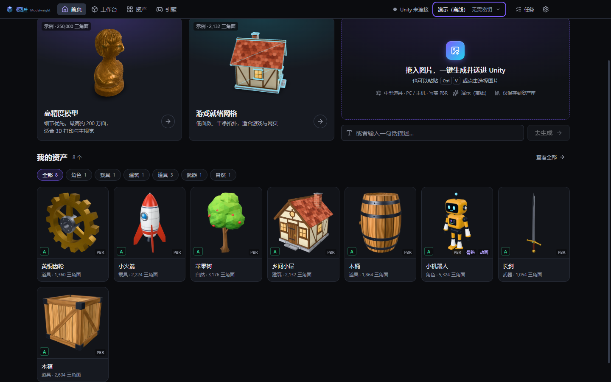
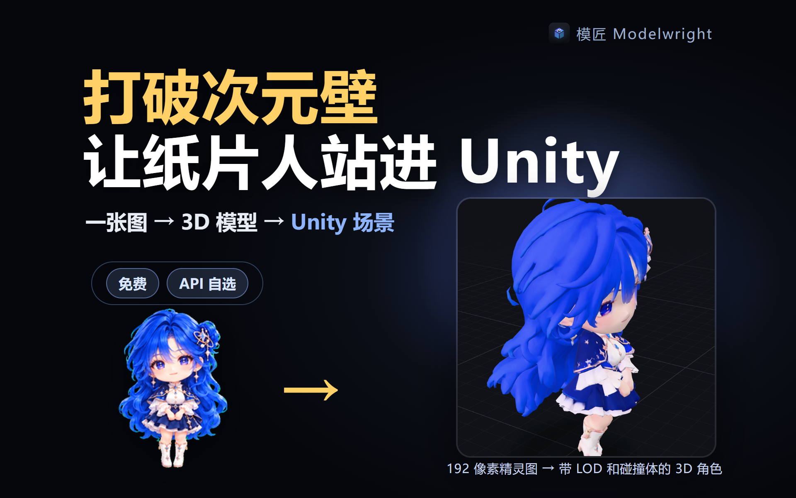
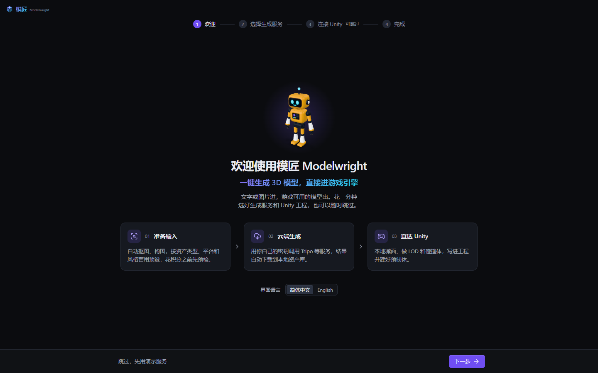
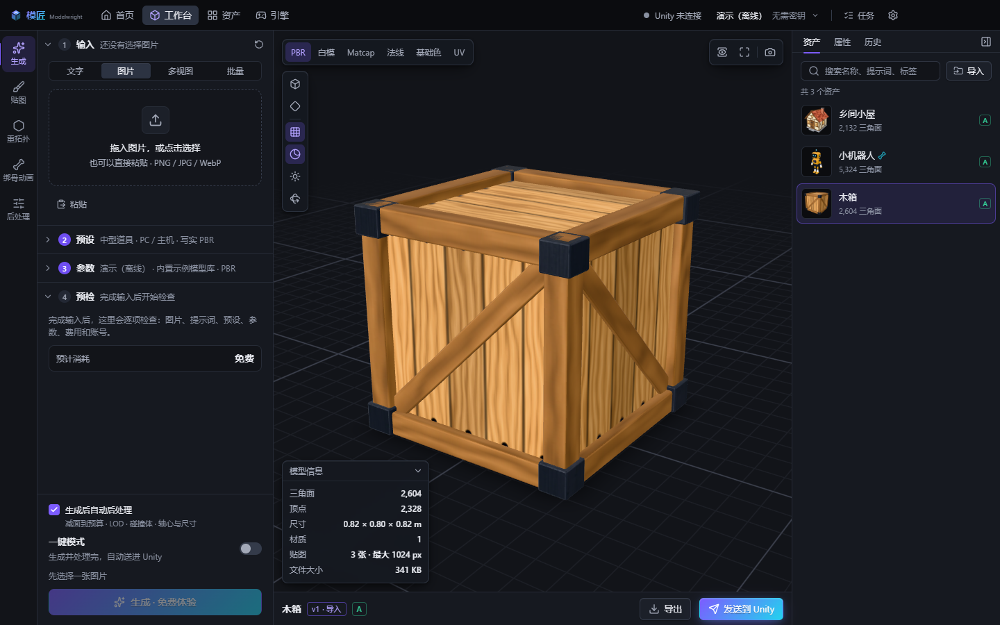
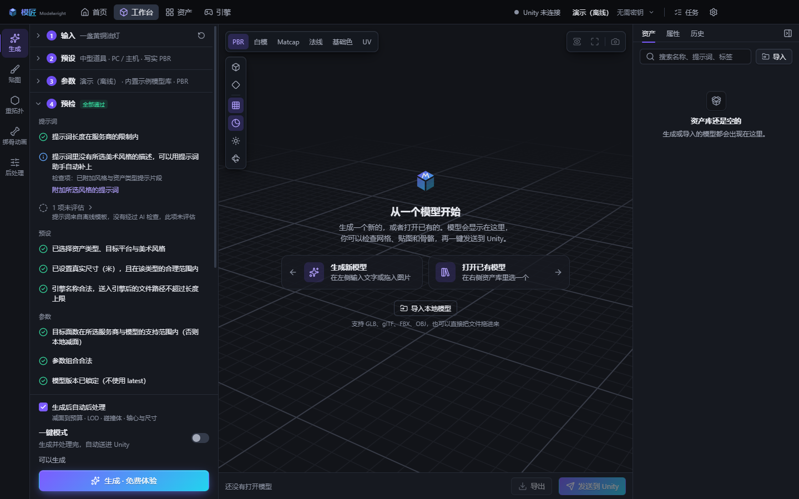
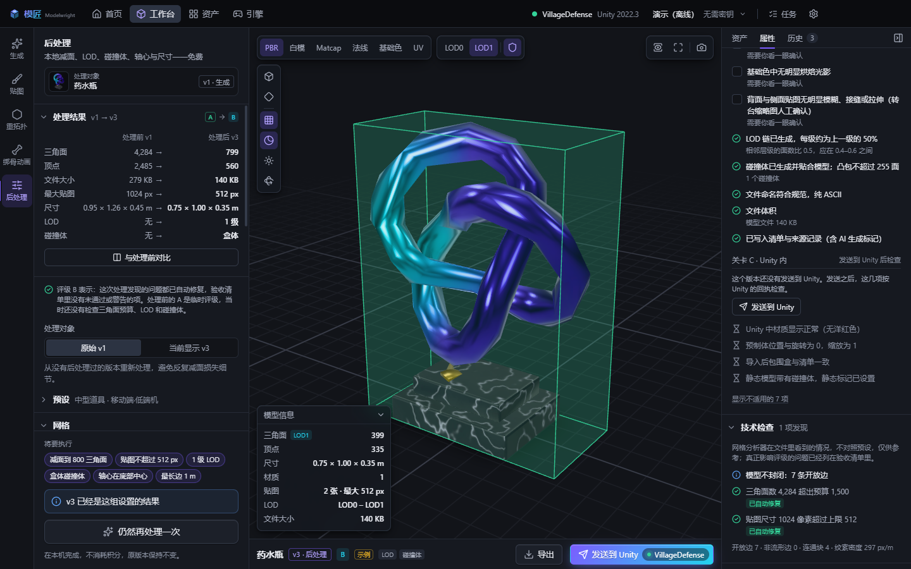
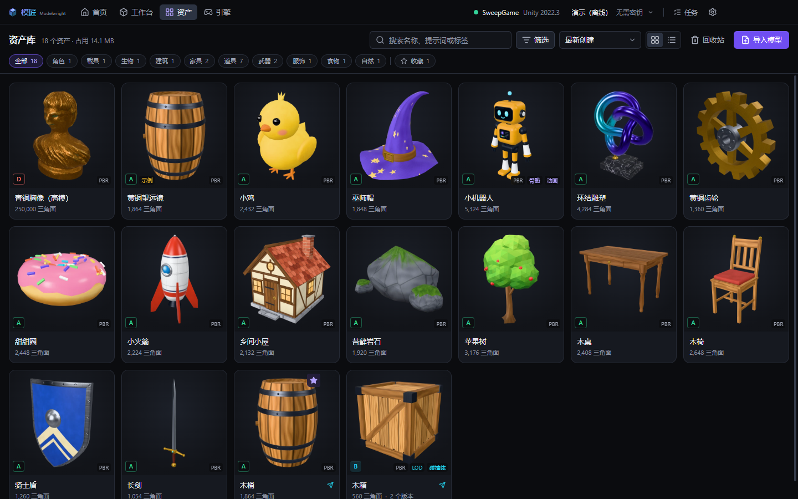
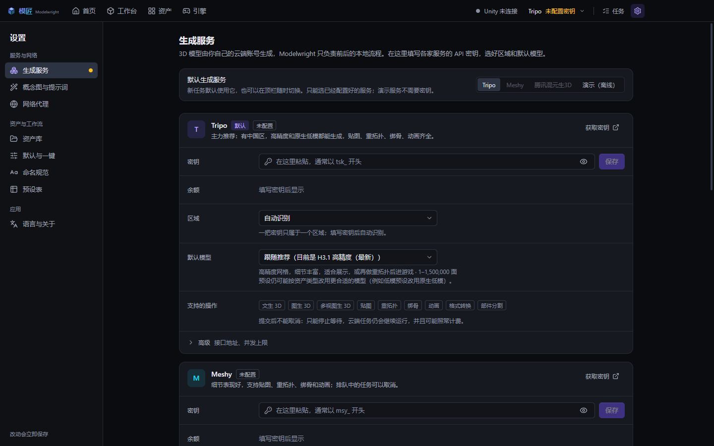

  

<h1 align="center">Modelwright · 模匠</h1>

<b>面向游戏开发者的 AI 3D 生成工作台：一键生成 3D 模型，直接进游戏引擎。</b> 把 AI 生成的粗坯做成能进引擎的成品——模匠。

  <a href="https://github.com/chenyihang98-pixel/Modelwright/releases/latest">下载最新版</a> ·
  <a href="https://chenyihang98-pixel.github.io/Modelwright/">介绍页</a> ·
  <a href="https://www.bilibili.com/video/BV1VMHU6mEQt">演示视频</a> ·
  <a href="#第一次使用">第一次使用</a> ·
  <a href="#连接-unity">连接 Unity</a> ·
  <a href="#验证情况与已知限制">验证情况</a> ·
  <a href="LICENSE.txt">许可协议</a>

文字或图片进，游戏可用的模型出——本地完成减面、LOD、碰撞体、轴心与尺寸，再直接送进你的 Unity 工程。生成本身由云端服务完成（你自己的 API 密钥），本机不需要下载任何大模型权重；换一台电脑，装上应用、填入密钥即可继续工作。

> 当前版本 **0.1.2**（2026-10-09）：绑骨和动作用真实 Tripo 密钥逐项实测跑通（双足角色 → 绑骨模型 v1.0 + 服务商原生骨骼命名，idle / walk / run 等动作一次到位；多动作输出 FBX），带动作的角色送进 Unity 自动配好 Animator；0.1.1 修复了 Unity 6 下贴图丢失的问题并加入自动更新。哪些经过了验证、哪些还没有，见文末「验证情况与已知限制」；改动清单见 [RELEASE-NOTES.md](RELEASE-NOTES.md)。

## 演示视频

一张 192 × 208 像素的桌宠精灵图，在模匠里生成、本地后处理、验收，再一键送进 Unity 6 的场景，全程实录（1 分 46 秒）。B 站：<https://www.bilibili.com/video/BV1VMHU6mEQt>

## 下载

Windows 10 / 11，64 位。三种形式任选其一，从 [Releases](https://github.com/chenyihang98-pixel/Modelwright/releases/latest) 下载：

| 文件 | 说明 |
|---|---|
| `Modelwright-Setup-0.1.1-x64.exe` | 安装版（安装向导）。默认只为当前用户安装，不需要管理员权限，可以选择安装目录；选「为所有用户安装」时 Windows 会请求管理员权限。**只有安装版会自动更新** |
| `Modelwright-Portable-0.1.1-x64.exe` | 便携版。单个文件，双击即用；设置、密钥、数据库和资产库都保存在 exe 旁边的 `Modelwright-Data` 文件夹，可以整个放在移动硬盘里带走 |
| `Modelwright-0.1.1-win.zip` | 免安装压缩包，解压后运行 `Modelwright.exe`。在 `Modelwright.exe` 旁边放一个名为 `portable.flag` 的空文件，它也会把数据保存在自己目录下的 `data` 文件夹 |

安装包**没有代码签名**：第一次运行时 Windows SmartScreen 可能提示「Windows 已保护你的电脑」，点「更多信息 → 仍要运行」即可。每个文件的 SHA-256 校验值写在对应 Release 的说明里，下载后可以核对。

### 自动更新

从 0.1.1 起，**安装版**启动几秒后会到本仓库的 Releases 检查新版本：有新版本就在后台下载，下载完在窗口顶部提示「重启后生效」，也会在下次退出时自动安装。可以在「设置 → 语言与关于」里关闭自动检查，或手动点「检查更新」。更新包同样来自 GitHub Releases，下载慢或失败时应用只记录日志，不会打扰你。便携版和 zip 不会自动更新，请回到 Releases 下载新版本。0.1.0 还没有这个功能，所以从 0.1.0 升级到 0.1.1 需要手动下载安装一次（安装到原目录即可，资产库和设置都会保留）。

## 能做什么

| 环节 | 内容 |
|---|---|
| 准备输入 | 图片自动抠图、构图、尺寸适配；拆分三视图 / 四视图设定图；提示词优化（可接大模型，也可离线模板）；可先出概念图再生成 3D；批量：一行一个描述，逐行自动识别资产类型并给出引擎名称，检查后一次确认、一起提交 |
| 预设 | 14 种资产类型 × 7 种目标平台 × 5 种风格，自动换算面数预算、贴图尺寸、LOD、碰撞体、轴心与真实尺寸 |
| 命名 | 每个资产有显示名称（中文即可）和引擎名称（ASCII）。中文名称自动转写为拼音：木桶 → `MuTong`、骑士长剑 → `QiShiChangJian`；提交前可以改。Unity 里的文件夹、模型、贴图、预制体都按引擎名称和「设置 → 命名规范」命名 |
| 预检 | 花积分之前逐项检查图片、提示词、参数、费用与余额，能自动修的直接修 |
| 生成 | Tripo（V3，中国区 / 国际区自动识别）、Meshy、腾讯混元生 3D；内置离线「演示服务」，无需密钥即可体验完整流程 |
| 后处理（本地、免费） | 减面到预算、生成 LOD 链、碰撞体、轴心与尺寸校正、Unity 贴图打包；在「资产」页可以多选后批量处理 |
| 验收 | 三道关卡逐项验收并给出 A–D 等级：生成后、本地后处理后、导入 Unity 后（由插件回传的结果判定材质、预制体、包围盒、LOD、碰撞体），每一项都说明问题和处理办法 |
| 资产库 | 版本历史、搜索（支持中文）、筛选、回收站、导出 GLB / OBJ / STL / PLY |
| 进引擎 | 一键写入 Unity 工程的 `Assets/Modelwright/`；装了插件会自动建材质、预制体（含 LODGroup 与碰撞体）并放进场景 |
| 任务队列 | 生成、后处理、发送都在后台排队执行；一次批量生成、批量后处理或批量发送在队列里是一组，可以整组停止、继续或重试失败项；应用重启后队列照常恢复 |

界面为简体中文，可在「设置 → 语言与关于」切换为英文。

## 截图

| | |
|---|---|
|  |  |
| 首次引导：选生成服务、连接 Unity，也可以随时跳过 | 工作台：PBR / 白模 / 法线 / UV 显示，模型信息与资产列表 |
|  |  |
| 花积分之前逐项预检：提示词、预设、参数、费用 | 本地后处理：减面、LOD、碰撞体，处理前后对比与验收清单 |
|  |  |
| 资产库：分类、评级、PBR / 骨骼 / LOD 标记、已发送标记 | 生成服务：填入你自己的密钥，自动识别区域，余额可见 |

## 第一次使用

1. 打开应用会进入引导：选择生成服务。还没有密钥就选 **演示（离线）**——演示服务完全离线，返回的是内置的示例模型（不是按你的描述生成的，结果上带「示例」标记），用来走通整个流程：预设、预检、后处理、验收、送进 Unity。
2. （可选）连接 Unity：应用会列出 Unity Hub / 团结 Hub 里的工程，也可以粘贴工程的完整路径；点「安装插件」。
3. 进入首页，把一张图片拖进「拖入图片，一键生成并送进 Unity」，或者输入一句话描述。
4. 结果会出现在首页和「资产」页；在「工作台」里可以查看网格、贴图、骨骼，做后处理、导出或发送到 Unity。

### 配置真实的生成服务

设置 → 生成服务。密钥只写入、不回显，使用 Windows 的系统加密保存在本机，界面、日志和任务记录里都不会出现密钥原文。

| 服务 | 获取密钥 | 说明 |
|---|---|---|
| Tripo | 中国区 <https://developers.tripo3d.com> ／ 国际区 <https://developers.tripo3d.ai> | 推荐。填入后自动识别密钥属于哪个区 |
| Meshy | <https://www.meshy.ai/developers/keys> | 需要付费方案才能创建 API 密钥 |
| 腾讯混元生 3D | <https://cloud.tencent.com/document/product/1804/126325> | 两种凭据：API Key（仅专业版生成）或 SecretId + SecretKey（全部功能） |

可选：设置 → 概念图与提示词，配置概念图服务（兼容 OpenAI 接口的各家、Tripo、Gemini）和提示词大模型（Anthropic，或兼容 OpenAI 接口的 DeepSeek / 通义 / 智谱 / 硅基流动 / Moonshot / OpenRouter / Ollama 等）。不配置也能用，只是没有概念图和智能优化。

**网络**：设置 → 网络代理，默认跟随系统代理（Clash、v2rayN 的「系统代理」模式可直接使用）。「测试连接」会逐个探测各服务地址。

**费用**：生成消耗的是你在各服务商账户里的积分。

- 提交前显示预计消耗；超过你设定的阈值必须确认，批量提交和失败任务的「重试」也一样（重试按钮上直接写着预计消耗）。
- 会计费的请求绝不自动重发。提交后没有得到服务商答复的任务（可能已经计费）会在首页顶部和「任务」上醒目提示，由你决定采用、重新提交还是放弃。
- 服务商不支持取消已经开始的云端任务时，「停止等待」之前界面会说明：它仍会在云端继续运行，并且可能照常计费。
- 金额只在应用有依据时才显示：Tripo 国际区按 $0.01 / 积分估算并注明是估算；Tripo 中国区和自定义接口地址只显示积分，不折算金额。

## 连接 Unity

支持 Unity 2022.3 LTS、团结引擎 1.x、Unity 6；Built-in / URP / HDRP。

在「引擎」页添加工程并点「安装插件」（插件是嵌入式包 `Packages/com.modelwright.bridge`，只在编辑器里运行，不进构建产物）。发送之后得到什么，取决于工程当时的状态：

| 工程状态 | 结果 |
|---|---|
| 已装插件，编辑器开着（已连接） | 立即导入：按渲染管线生成材质，做好带 LOD 和碰撞体的预制体，放进场景，并把导入结果（材质、预制体、包围盒、LOD、碰撞体）回传给桌面端，验收清单的「Unity 内」一关据此判定 |
| 已装插件，编辑器没开 | 文件先写进工程，下次打开或刷新时由插件完整导入（不放进场景，没有回执） |
| 没装插件 | 只写入文件到 `Assets/Modelwright/`，由 Unity 按默认方式导入，没有预制体 |

GLB 需要 glTF 导入器（glTFast）：工程里没有时，应用会让你选择「安装 glTFast（推荐）／云端转成 FBX／本地导出 OBJ」。带骨骼的模型在装了 glTFast 的工程里可以直接按 GLB 发送（Generic 骨架，不花积分）；需要 Humanoid 重定向时再选云端转 FBX。带动作的角色发送后，插件会在预制体旁生成一个 Animator 控制器（每个动作一个状态，idle 为默认），放进场景按 Play 就会动；你自己换的控制器不会被覆盖。桌面端和插件之间只通过本机回环地址通信，数据不离开这台电脑。

## 数据保存在哪里

| 内容 | 安装版 | 便携版（单文件 exe） | zip 版 + `portable.flag` |
|---|---|---|---|
| 资产库（模型、贴图、缩略图、输入图片） | `文档\Modelwright` | `Modelwright-Data\Library` | `data\Library` |
| 设置、密钥（已加密）、数据库 | `%APPDATA%\Modelwright\data` | `Modelwright-Data\data` | `data\data` |
| 日志 | `%APPDATA%\Modelwright\logs\main.log` | `Modelwright-Data\logs\main.log` | `data\logs\main.log` |

资产库位置可在「设置 → 资产库」更改或整体迁移；日志可以在「设置 → 语言与关于」里直接打开。密钥用 Windows 当前账户加密：把便携版拿到另一台电脑（或另一个 Windows 账户）后，需要重新填一次密钥，其余数据照常可用。卸载安装版不会删除资产库和设置。

## 隐私与安全

- 没有自己的服务器：应用不收集、不上传你的数据；只有在你主动发起生成等操作时，相关内容才会发送给你选定的服务商。
- 密钥只存在本机，由操作系统加密；界面层永远拿不到密钥，也不直接访问互联网。
- 应用代码带完整性校验：安装目录里的程序文件被改动后应用会拒绝启动。
- 随包附带全部第三方组件的许可证全文（`THIRD-PARTY-NOTICES.txt`，也可在「设置 → 语言与关于 → 第三方许可」查看）。
- 程序未签名；请只从本页的 Releases 下载，并核对 SHA-256。

## 验证情况与已知限制

**已验证**

- 真实应用的自动化测试覆盖引导、首页一键流程、生成面板与图片处理、工作台、资产库、引擎页与发送、设置，另有七段完整的用户旅程（第一晚、从一句话开始、付费服务商、出错的情况、第二天重新打开、英文界面、二十件道具的批量）和全部界面在 1440×900 / 1100×700、中文 / 英文下的巡检。
- 付费流程用本机模拟的接口逐请求计数验证过：一次提交（包括双击、重试、批量）只发出应有的那些计费请求。
- 发布的三个文件由同一份源码构建；安装目录和便携版通过自检（含抠图引擎、网格管线、Draco 解码、第三方许可清单）。
- 用假密钥访问各服务商的真实接口：地址、TLS、鉴权失败的识别都正确（Tripo 两个区、Meshy、混元、Anthropic、Gemini）。

**尚未验证——使用前请知悉**

- **Meshy、混元的真实生成**：这两家只对照公开文档实现并用模拟服务测试过（Tripo 已用真实密钥验证，见下文）。第一次请用少量积分试一次最便宜的生成，确认结果正常再批量使用。
- **Unity 6000.6.4f1（Unity 6.6）实测（2026-10-08）**：在真实编辑器里用安装版完整走过一遍——编辑器开着时从桌面端安装插件、安装 glTFast 6.20.0、自动连接、发送 GLB、生成材质 / 预制体（LODGroup、盒体碰撞体）并放进场景、回传结果。实测发现并已在 0.1.1 修复：Unity 6 会把贴图自动当成立方体贴图导入导致材质无贴图；同一资产重复发送会重复放置实例。2026-10-09 又用 0.1.2 把带动作的角色（绑骨 + idle / walk / run 的 FBX）发进同一个工程：插件在编辑器开着时升级到 0.1.2，Unity 为 Tripo 原生命名的骨架自动生成了有效的 Humanoid Avatar，预制体旁生成了带 3 个动作、默认 idle 的 Animator 控制器，验收清单「人形 Avatar 有效」一行写明「Animator 已配 3 个动作」。**Unity 2022.3 和团结引擎仍只经过离线编译检查，尚未在真实编辑器中验收。**
- **真实付费密钥实测（Tripo 中国区，2026-10-09）**：图片生成一次成功。0.1.1 时两次绑骨失败，根因是桌面端把双足角色送到了只用于非人形生物的绑骨模型 v2.5。0.1.2 用真实密钥把「绑骨 → 动作」整条链逐项实测：双足角色用 v1.0 + Tripo 原生骨骼命名，idle / walk / run 等动作、一次多个动作、FBX 输出、原地播放全部成功；四足生物用 v2.5 + 四足行走动作成功；Mixamo 命名的绑骨和 v2.5 绑出的双足角色不能套 Tripo 的动作（任务错误 1004），应用会在发送前拦下。绑骨失败时仍会按静态角色继续处理，可稍后在工作台重试。注意 Tripo 结果文件走的 CDN（`openapi.cdn.tripo3d.com`）在部分网络下时通时断，应用会自动重试并显示重试次数；长时间连不上时任务会失败，网络恢复后在队列里重试即可。
- 安装版已在 Windows 11 上实际安装并运行；卸载流程仍未实际验证。

**已知限制**

- 仅支持 Windows。只完整支持 Unity；Unreal / Godot / Blender 只预留了位置。
- 本地后处理不处理带骨骼的模型和只有 FBX 的版本；KTX2 压缩贴图无法在本地缩放。
- 本地抠图用的是小模型（u2netp），背景复杂时边缘可能带残留，图片处理窗口里可以用擦除 / 恢复画笔修正。
- 引擎名称的拼音转写按词读多音字（长剑读 Chang、重甲读 Zhong），生僻词可能读错；超过六个音节的中文描述只取末尾六个音节。名称在提交前可见、可改。
- 批量里的资产类型按关键词离线识别（武器、载具、建筑、角色、植物等）；「木桶」「宝箱」这类没有特征词的道具沿用面板当前的资产类型，审核表顶部会写明有几条是这样，可以逐行或一键统一修改。
- 演示服务返回的是内置示例模型，与你的描述无关；它只用于体验流程。
- 手动代理 + 用户名密码 + 明文 http 接口这一种组合下，代理刚切换后的第一个计费请求在极端情况下可能被发送两次（各真实服务都是 https，不受影响）。

## 反馈

问题、建议和权利声明请提交到本仓库的 [Issues](https://github.com/chenyihang98-pixel/Modelwright/issues)。提交问题时请附上应用版本、操作步骤和「设置 → 语言与关于」里打开的日志（日志里不含密钥）。

## 许可

本软件按 [最终用户许可协议](LICENSE.txt)（[English](LICENSE-en.txt)）授权使用，不是开源软件；源码不公开。随包分发的第三方组件按各自的许可证使用，见 [THIRD-PARTY-NOTICES.txt](THIRD-PARTY-NOTICES.txt)。Tripo、Meshy、腾讯混元、Unity 等名称为其各自权利人的商标，仅用于说明兼容性。

---

<b>English</b>

**Modelwright** is a Windows desktop workbench for game developers: text or image in, a game-ready 3D model out, delivered straight into your Unity project. Generation runs on cloud services with your own API keys (Tripo, Meshy, Tencent Hunyuan; an offline demo service needs no key); everything around the cloud call is local — input preparation, presets per asset type / platform / style, pre-flight checks and cost estimates before credits are spent, download, decimation / LOD / collider post-processing, a three-gate quality check, an asset library, and one-click delivery through a Unity editor plugin.

Download the installer, the portable exe or the zip from [Releases](https://github.com/chenyihang98-pixel/Modelwright/releases/latest) (Windows 10/11 x64; unsigned — SmartScreen may warn). The UI is Chinese first; switch to English in Settings → Language & about. Keys are stored only on your machine, encrypted by Windows; the app has no server of its own. Not yet verified: generation with a real paid key, the plugin inside a real Unity editor, and the installer's own install/uninstall flow. Licensed under the [EULA](LICENSE-en.txt); third-party components under their own licences ([notices](THIRD-PARTY-NOTICES.txt)).

